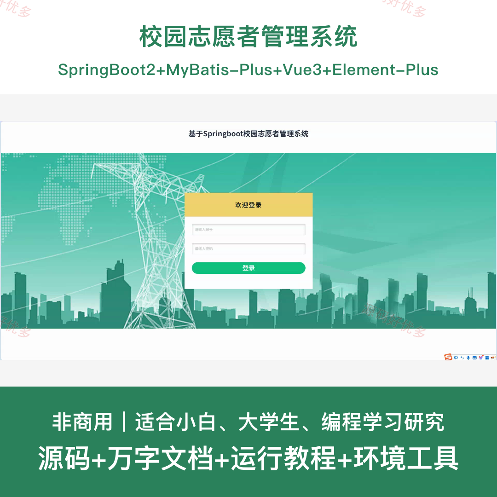
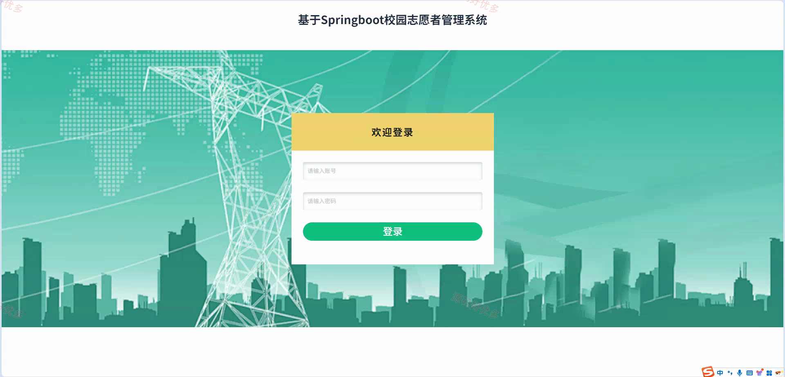
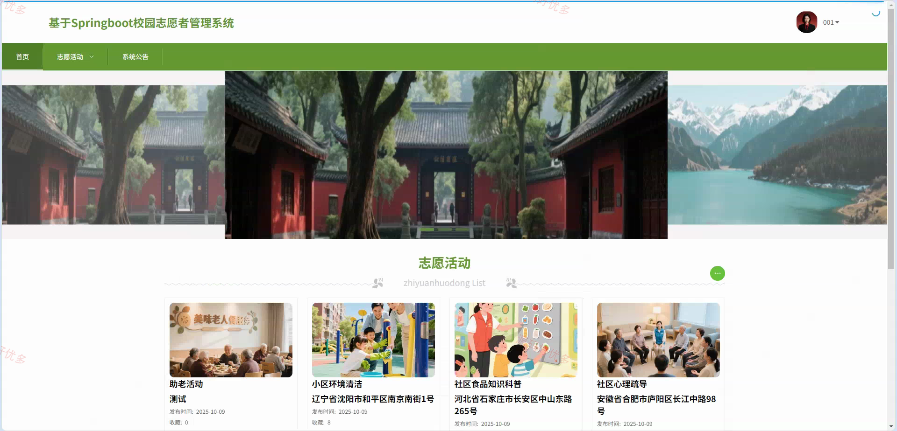
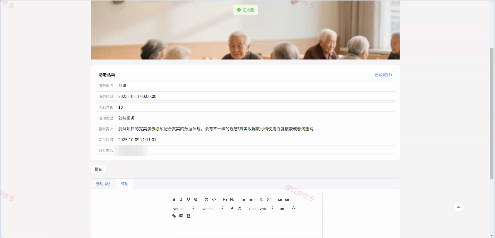
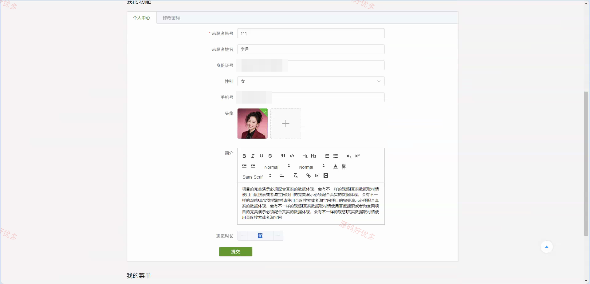
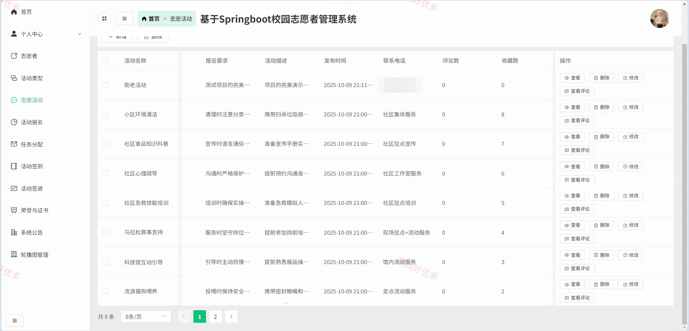
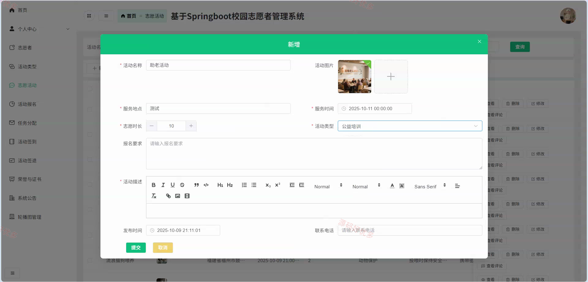
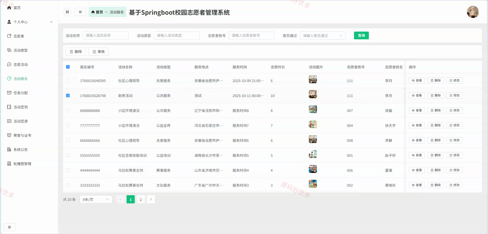
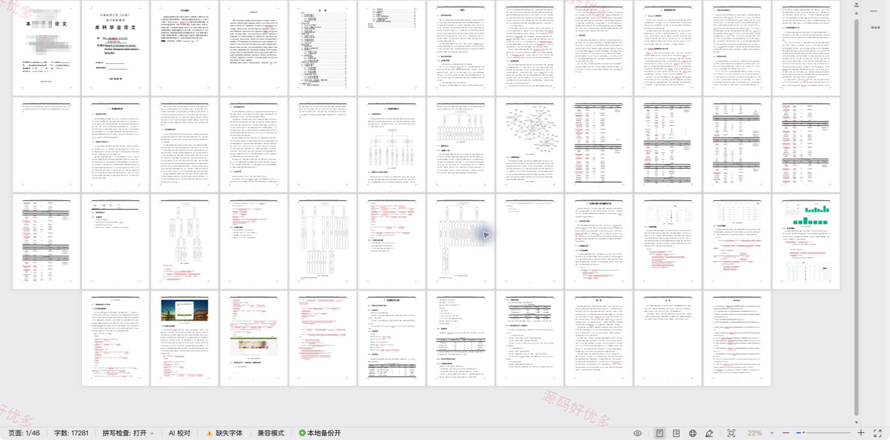

## 源码问题查看主页咨询

### 一、关键词
校园志愿服务、志愿活动、活动报名、签到签退、志愿时长

### 二、作品包含
源码+数据库+万字设计文档+全套环境和工具资源+本地部署教程

### 三、项目技术
前端技术： Html、Css、Js、Vue3.5、Element-Plus
后端技术：Java、SpringBoot2.2.2、MyBatis-Plus

### 四、运行环境（以下版本亲测，其他版本兼容性请自行测试）
开发工具：IDEA/eclipse + VSCODE

数据库：MySQL5.7+（共14张表）

数据库管理工具：Navicat10以上版本

环境配置软件： JDK1.8 + Maven3.6.3

前端Nodejs：16+

浏览器：谷歌浏览器

### 五、项目介绍
项目编号：springbootA622D

校园志愿者管理系统面向志愿者与管理员，覆盖志愿活动发布与报名、任务分配、签到签退、志愿时长、荣誉证书和公告管理等业务，用于支撑校园志愿服务的全流程管理。

角色：志愿者、管理员

志愿者功能：志愿活动浏览与报名、系统公告查看、活动报名记录查看、任务分配查看与签到、活动签到与签退管理、荣誉证书查看、个人信息与密码维护、收藏管理。

管理员功能：志愿者管理、活动类型管理、志愿活动与评论管理、活动报名审核与任务分配、任务与签到签退管理、荣誉证书管理、系统公告管理、轮播图管理。

### 六、运行截图

